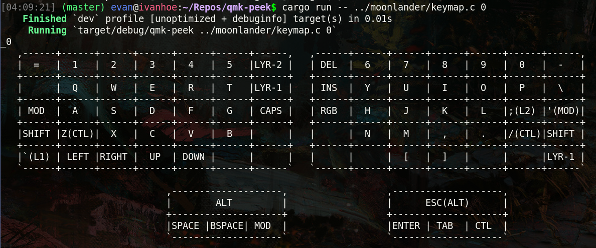

# :keyboard: qmk-peek
A small CLI that reads a QMK `keymap.c` and prints your keyboard's layers as readable ASCII diagrams, without flashing firmware or opening the QMK configurator.



## :spiral_notepad: Implementation Details
Parses the `LAYOUT_xxx(...)` macro calls out of a QMK keymap source file and renders each layer as an ASCII grid matching the physical key layout.

### Keymap Parsing
- Detects which `LAYOUT_xxx` macro the keymap uses out of the supported boards.
- Extracts each `[N] = LAYOUT_xxx(...)` layer definition, tracking parenthesis depth so nested keycodes (`MT(...)`, `LT(...)`, etc.) parse correctly.

### Keycode Formatting
- Abbreviates common `KC_*` keycodes to short labels (e.g. `KC_ENTER` -> `ENTER`, `KC_LSFT` -> `SHIFT`).
- Formats mod-tap (`MT`), layer-tap (`LT`), and layer-switch (`TG`/`MO`/`TO`/`DF`/`OSL`) keycodes into compact combined labels.

### Supported Boards
- **Moonlander** : ZSA Moonlander (`LAYOUT_moonlander`), including its split thumb clusters.

### CLI Usage
- **No arguments** : reads `keymap.c` from the current directory and prints every layer.
- **Path argument** : `qmk-peek path/to/keymap.c` prints every layer in that file.
- **Layer number arguments** : `qmk-peek 0 2` prints only layers 0 and 2 from `keymap.c`.
- **Path + layer numbers** : `qmk-peek path/to/keymap.c 0 2` prints only those layers from that file.

## :gear: Install Instructions
1. Clone this repository.
2. Run `cargo install --path .` to install the `qmk-peek` binary, or use `cargo run --` directly from the repo (see Build Instructions).

## :hammer_and_wrench: Local Build Instructions
```bash
cargo build
```
The compiled binary is written to `target/release/qmk-peek`.
